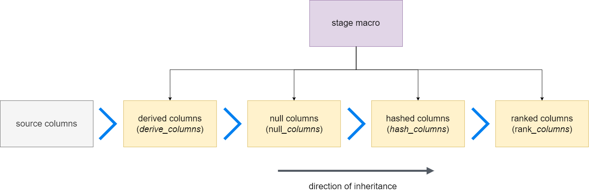

# Stage Macro configurations

The stage macro provides a variety of configurations to allow users to generate new columns using metadata about 
columns which exist in the source data.

These new columns can include but are not limited to:

- [Concatenations of columns](#defining-composite-columns)
- [Hash keys and hashdiffs](#hashed-columns)
- [NULL replacement values for business keys](#enabling-null-key-value-replacement)

!!! note
    This section documents some specific use cases for certain stage configurations. If you feel any are missing, please 
    get in touch on GitHub!

??? video
    <iframe width="560" height="315" src="https://www.youtube-nocookie.com/embed/7yyrARKipeA" title="YouTube video player" frameborder="0" allow="accelerometer; autoplay; clipboard-write; encrypted-media; gyroscope; picture-in-picture" allowfullscreen></iframe>

## Available configurations

1. [Derived Columns](#derived-columns)
2. [Null Columns](#null-columns)
3. [Hashed Columns](#hashed-columns)
4. [Ranked Columns](#ranked-columns)

Each of the above are described in more detail below; use the links above for convenience.

## Column definition scoping

<figure markdown>
  { width="700" }
</figure>

Stage configuration can inherit column definitions from each-other in the order of their definition in the stage macro 
internal code. The diagram above describes this hierarchy and inheritance. In english, this is as follows:

- Source columns are available to all configurations if `include_source_columns` is set to true, which is the default.
- Derived columns have access to all source columns.
- Null columns have access to all derived columns and source columns.
- Hashed columns have access to all derived columns, source columns and null columns
- Ranked columns have access to all source, null, derived, and hashed columns

The above rules open up a number of possibilities:

1. Hashed column configurations may refer to columns which have been newly created in the derived
column configuration.
2. Derived columns are generated in addition to the source column in its derived form, so you can retain the original value for audit purposes.

!!! note
    An exception to #2 arises when [overriding source columns](#overriding-source-column-names)

### Scoping example using derived and hashed column configurations

=== "Snowflake"

    ```yaml hl_lines="3 12"
    source_model: MY_STAGE
    derived_columns:
      CUSTOMER_DOB_UK: "TO_VARCHAR(CUSTOMER_DOB::date, 'DD-MM-YYYY')"
      RECORD_SOURCE: "!RAW_CUSTOMER"
      EFFECTIVE_FROM: BOOKING_DATE
    hashed_columns:
      CUSTOMER_HK: CUSTOMER_ID
      HASHDIFF:
        is_hashdiff: true 
        columns:
          - CUSTOMER_NAME
          - CUSTOMER_DOB_UK
          - CUSTOMER_PHONE
    ```

=== "MS SQL Server"

    ```yaml hl_lines="3 12"
    source_model: MY_STAGE
    derived_columns:
      CUSTOMER_DOB_UK: "CONVERT(VARCHAR(10), CONVERT(DATE, CUSTOMER_DOB, 103), 105)"
      RECORD_SOURCE: "!RAW_CUSTOMER"
      EFFECTIVE_FROM: BOOKING_DATE
    hashed_columns:
      CUSTOMER_HK: CUSTOMER_ID
      HASHDIFF:
        is_hashdiff: true 
        columns:
          - CUSTOMER_NAME
          - CUSTOMER_DOB_UK
          - CUSTOMER_PHONE
    ```

Here, we create a new derived column called `CUSTOMER_DOB_UK` which formats the `CUSTOMER_DOB` column
(contained in our source) to use the UK date format, using a function. We then use the new `CUSTOMER_DOB_UK` as a
component of the `HASHDIFF` column in our `hashed_columns` configuration.

## Derived columns

The derived columns configuration in the stage macro allows users to seamlessly create new columns based on the values
of columns which exist in the source model for the stage model. 

This section describes some specific use cases for the derived columns configuration, with examples.

!!! tip
    You should of course be careful to avoid creating soft rules or business rules in staging. Derived columns
    are intended for creating minimal hard rules. 

### Basic Usage

```sql

derived_columns:
  RECORD_SOURCE: "!WORDPRESS"
   
    


{{ dbtvault.stage(include_source_columns=true,
                  source_model=source_model,
                  derived_columns=metadata_dict['derived_columns'],
                  null_columns=null_columns,
                  hashed_columns=hashed_columns,
                  ranked_columns=ranked_columns) }}
```

!!! note
    [More examples](../metadata.md#staging)
    

### Overriding source column names

It is possible to re-use column names present in the source, for **derived and hashed columns**. This is useful if you
wish to replace the value of a source column with a new value. For example, if you wish to cast a value:

```yaml
source_model: "MY_STAGE"
derived_columns:
  CUSTOMER_DOB: "TO_VARCHAR(CUSTOMER_DOB::date, 'DD-MM-YYYY')"
```

The above snippet, which includes a `derived_columns` configuration, will re-format the date in the `CUSTOMER_DOB`
column, and alias it to `CUSTOMER_DOB`, effectively replacing the value present in that column in this staging layer.

There should not be a frequent need for this functionality, and it is advisable to keep the old column value around for
audit purposes, however this could be useful in specific situations.


### Defining new columns with functions

=== "Snowflake"

    ```yaml hl_lines="3"
    source_model: MY_STAGE
    derived_columns:
      CUSTOMER_DOB_UK: "TO_VARCHAR(CUSTOMER_DOB::date, 'DD-MM-YYYY')"
      RECORD_SOURCE: "!RAW_CUSTOMER"
      EFFECTIVE_FROM: BOOKING_DATE
    ```

=== "MS SQL Server"

    ```yaml hl_lines="3"
    source_model: MY_STAGE
    derived_columns:
      CUSTOMER_DOB_UK: "CONVERT(VARCHAR(10), CONVERT(DATE, CUSTOMER_DOB, 103), 105)"
      RECORD_SOURCE: "!RAW_CUSTOMER"
      EFFECTIVE_FROM: BOOKING_DATE
    ```

In the above example we can see the use of a function to convert the date format of the `CUSTOMER_DOB` to create a new
column `CUSTOMER_DOB_UK`. Functions are incredibly useful for calculating values for new columns in derived column
configurations.

In the highlighted derived column configuration in the snippet above, the generated SQL would be the following:

```sql
SELECT TO_VARCHAR(CUSTOMER_DOB::date, 'DD-MM-YYYY') AS CUSTOMER_DOB_UK
```

!!! note 
    Please ensure that your function has valid SQL syntax on your platform, for use in this context.

### Defining Constants

=== "Snowflake"

    ```yaml hl_lines="4"
    source_model: MY_STAGE
    derived_columns:
      CUSTOMER_DOB_UK: "TO_VARCHAR(CUSTOMER_DOB::date, 'DD-MM-YYYY')"
      RECORD_SOURCE: "!RAW_CUSTOMER"
      EFFECTIVE_FROM: BOOKING_DATE
    ```

=== "MS SQL Server"

    ```yaml hl_lines="4"
    source_model: MY_STAGE
    derived_columns:
      CUSTOMER_DOB_UK: "CONVERT(VARCHAR(10), CONVERT(DATE, CUSTOMER_DOB, 103), 105)"
      RECORD_SOURCE: "!RAW_CUSTOMER"
      EFFECTIVE_FROM: BOOKING_DATE
    ```

In the above example we define a constant value for our new `SOURCE` column. We do this by prefixing our string with an
exclamation mark: `!`. This is syntactic sugar provided by dbtvault to avoid having to escape quotes and other
characters.

As an example, in the highlighted derived column configuration in the snippet above, the generated SQL would look like
the following:

=== "Snowflake"

    ```sql hl_lines="3"
    SELECT 
        TO_VARCHAR(CUSTOMER_DOB::date, 'DD-MM-YYYY') AS CUSTOMER_DOB_UK,
        'RAW_CUSTOMER' AS RECORD_SOURCE,
        BOOKING_DATE AS EFFECTIVE_FROM
    ```

=== "MS SQL Server"

    ```sql hl_lines="3"
    SELECT 
        CONVERT(VARCHAR(10), CONVERT(DATE, CUSTOMER_DOB, 103), 105) AS CUSTOMER_DOB_UK,
        'RAW_CUSTOMER' AS RECORD_SOURCE,
        BOOKING_DATE AS EFFECTIVE_FROM
    ```

And the data would look like:

| CUSTOMER_DOB_UK | RECORD_SOURCE | EFFECTIVE_FROM |
|-----------------|---------------|----------------|
| 09-06-1994      | RAW_CUSTOMER  | 01-01-2021     |
| .               | RAW_CUSTOMER  | .              |
| .               | RAW_CUSTOMER  | .              |
| 02-01-1986      | RAW_CUSTOMER  | 07-03-2021     |


### Defining Composite columns

```yaml hl_lines="3 4 5 6"
source_model: MY_STAGE
derived_columns:
  CUSTOMER_NK:
    - CUSTOMER_ID
    - CUSTOMER_NAME
    - "!DEV"
  RECORD_SOURCE: !RAW_CUSTOMER
  EFFECTIVE_FROM: BOOKING_DATE
```

You can create new columns, given a list of columns to extract values from, using derived columns.

Given the following values for the columns in the above example:

- `CUSTOMER_ID` = 0011
- `CUSTOMER_NAME` = Alex

The new column, `CUSTOMER_NK`, would contain `0011||Alex||DEV`. 

The values get joined in the order provided, using a double pipe `||`. 

!!! tip
    [Configure the join string value](./index.md#global-variables)

The values provided in the list can use any of the previously described syntax (including functions and constants) to
generate new values, as the concatenation happens in pure SQL, as follows:

```sql
SELECT CONCAT_WS('||', CUSTOMER_ID, CUSTOMER_NAME, 'DEV') AS CUSTOMER_NK
FROM MY_DB.MY_SCHEMA.MY_TABLE
```

### Escaping column names that are not SQL compliant

!!! note
    As of dbtvault 0.9.1, columns are **_not_** escaped by default. 

To enable the escaping functionality, a mapping of the source column name and an escape flag must be provided.
Alternatively, for computed derived columns, escape characters can be explicitly coded within the function itself.

Check out the following metadata examples:

=== "Snowflake"

    ```yaml
    source_model: "MY_STAGE"
    derived_columns:
      EFFECTIVE_FROM:
        source_column: "BOOKING DATE"
        escape: true
      BOOKING_DETAILS:
        source_column:
          - "BOOKING_DATE"
          - "!STG_BOOKING"
          - "CUSTOMER_NAME"
        escape: true
      BOOKING_FLAG: "NOT \"BOOKING COMPLETED\""
      CREATED_DATE: "TO_VARCHAR(\"CREATED DATE\"::date, 'DD-MM-YYYY')"
    ```

    Generated SQL:

    ```sql
    ...
    "BOOKING DATE" AS "EFFECTIVE_FROM",
    CONCAT_WS('||', "BOOKING_DATE", 'STG_BOOKING', "CUSTOMER_ID", "CUSTOMER_NAME") AS BOOKING_DETAILS,
    NOT "BOOKING COMPLETED" AS BOOKING_FLAG,
    TO_VARCHAR("CREATED DATE"::date, 'DD-MM-YYYY') AS CREATED_DATE,
    ...
    ```

=== "Google BigQuery"

    ```yaml
    source_model: "MY_STAGE"
    derived_columns:
      EFFECTIVE_FROM:
        source_column: "BOOKING DATE"
        escape: true
      BOOKING_DETAILS:
        source_column:
          - "BOOKING_DATE"
          - "!STG_BOOKING"
          - "CUSTOMER_NAME"
        escape: true
      BOOKING_FLAG: "NOT `BOOKING COMPLETED`"
      CREATED_DATE: "CAST(CAST(`CREATED DATE` AS DATE) AS STRING FORMAT 'DD-MM-YYYY')"
    ```

    Generated SQL:

    ```sql
    ...
    `BOOKING DATE` AS EFFECTIVE_FROM,
    CONCAT(`BOOKING_DATE`, '||', 'STG_BOOKING', '||', `CUSTOMER_ID`, '||', `CUSTOMER_NAME`) AS BOOKING_DETAILS,
    NOT `BOOKING COMPLETED` AS BOOKING_FLAG,
    CAST(CAST(`CREATED DATE` AS DATE) AS STRING FORMAT 'DD-MM-YYYY') AS CREATED_DATE,
    ...
    ```

!!! note 
    Please ensure that your functions have valid SQL syntax on your platform, for use in this context.

## Null Columns

This stage configuration provides the user with the means to define required and optional Null keys according to business
needs. This is a standard Data Vault 2.0 approach for ensuring that records are loaded into Hubs and Links even if they are null, 
allowing the business to enforce meaning for these keys.

### Enabling NULL key value replacement

Where key columns might have a null value in the source data and there is a requirement to import the associated records,
the null key can be replaced by a default value and the original null value stored in an additional column. The key might
be required, for instance where it is the basis for a hashed primary key, or it might be optional. 

- The default replacement value for a required key is -1
- The default replacement value for an optional key is -2

!!! tip
    [Configure replacement values](./index.md#global-variables)

The replacement process is enabled as follows:

=== "Null columns configuration"

    ```yaml
    source_model: MY_STAGE
    null_columns:
      required: 
        - CUSTOMER_ID
      optional:
        - CUSTOMER_REF
        - NATIONALITY 
    ```

=== "Generated SQL"

    ```sql
    CUSTOMER_ID AS CUSTOMER_ID_ORIGINAL,
    IFNULL(CUSTOMER_ID, '-1') AS CUSTOMER_ID,
    CUSTOMER_REF AS CUSTOMER_REF_ORIGINAL,
    IFNULL(CUSTOMER_REF, '-2') AS CUSTOMER_REF_ID,
    CUSTOMER_DOB AS CUSTOMER_DOB_ORIGINAL,
    IFNULL(CUSTOMER_DOB, '-2') AS CUSTOMER_DOB
    ```

## Hashed columns

The hashed columns configuration in the stage macro provides functionality to easily and reliably generated
hash keys and hashdiffs for various dbtvault (and Data Vault 2.0) tables and structures.

This section describes some specific use cases for the hashed columns configuration, with examples.

!!! Read more
    - [Hashing](../best_practises/hashing.md)

### Basic Usage

```sql

hashed_columns:
  CUSTOMER_HK: CUSTOMER_ID
   
    


{{ dbtvault.stage(include_source_columns=true,
                  source_model=source_model,
                  derived_columns=derived_columns,
                  null_columns=null_columns,
                  hashed_columns=metadata_dict['hashed_columns'],
                  ranked_columns=ranked_columns) }}
```

!!! note
    [More examples](../metadata.md#staging)
    
### Exclude Flag (hashed_columns)

A flag can be provided for hashdiff columns which will invert the selection of columns provided in the list of columns.

This is extremely useful when a hashdiff composed of many columns needs to be generated, and you do not wish to
individually provide all the columns.

The snippets below demonstrate the use of an `exclude_columns` flag. This will inform dbtvault to exclude the columns
listed under the `columns` key, instead of using them to create the hashdiff.

!!! tip "Hash every column without listing them all"
    You may omit the `columns` key to hash every column. See the `Columns key not provided` example below.

#### Examples

=== "Columns key provided"

    === "Columns in source model"
    
        ```text
        TRANSACTION_NUMBER
        CUSTOMER_DOB
        PHONE_NUMBER
        BOOKING_FK
        ORDER_FK
        CUSTOMER_HK
        LOAD_DATE
        RECORD_SOURCE
        ```
    
    === "hashed_columns configuration"
        
        ```yaml hl_lines="5"
        hashed_columns:
          CUSTOMER_HK: CUSTOMER_ID
          CUSTOMER_HASHDIFF:
            is_hashdiff: true
            exclude_columns: true
            columns:
              - BOOKING_FK
              - ORDER_FK
              - CUSTOMER_HK
              - LOAD_DATE
              - RECORD_SOURCE
        ```

    === "Equivalent hashed_columns configuration"
    
        ```yaml
        hashed_columns:
          CUSTOMER_HK: CUSTOMER_ID
          CUSTOMER_HASHDIFF:
            is_hashdiff: true
            columns:
              - TRANSACTION_NUMBER
              - CUSTOMER_DOB
              - PHONE_NUMBER
        ```

=== "Columns key not provided"

    === "Columns in source model"
    
        ```text
        TRANSACTION_NUMBER
        CUSTOMER_DOB
        PHONE_NUMBER
        BOOKING_FK
        ORDER_FK
        CUSTOMER_HK
        LOAD_DATE
        RECORD_SOURCE
        ```

    === "hashed_columns configuration"
        
        ```yaml hl_lines="5"
        hashed_columns:
          CUSTOMER_HK: CUSTOMER_ID
          CUSTOMER_HASHDIFF:
            is_hashdiff: true
            exclude_columns: true
        ```
    
    === "Equivalent hashed_columns configuration"
    
        ```yaml
        hashed_columns:
          CUSTOMER_HK: CUSTOMER_ID
          CUSTOMER_HASHDIFF:
            is_hashdiff: true
            columns:
              - TRANSACTION_NUMBER
              - CUSTOMER_DOB
              - PHONE_NUMBER
              - BOOKING_FK
              - ORDER_FK
              - CUSTOMER_HK
              - LOAD_DATE
              - RECORD_SOURCE
        ```

!!! warning
    Care should be taken if using this feature on data sources where the columns may change. 
    If you expect columns in the data source to change for any reason, it will become hard to predict what columns 
    are used to generate the hashdiff. If your component columns change, then your hashdiff output will also change,
    and it will cause unpredictable results.

## Ranked Columns

Generates SQL to create columns using the `RANK()` or `DENSE_RANK()` window function. This is predominantly for use with
[custom dbtvault materialisations](../materialisations.md).

### Defining and configuring Ranked columns

This stage configuration is a helper for
the [vault_insert_by_rank](../materialisations.md#vault_insert_by_rank-insert-by-rank) materialisation.
The `ranked_columns` configuration allows you to define ranked columns to generate, as follows:

=== "Single item parameters"

    ```yaml
    source_model: MY_STAGE
    ranked_columns:
      DBTVAULT_RANK:
        partition_by: CUSTOMER_HK
        order_by: LOAD_DATETIME
      SAT_BOOKING_RANK:
        partition_by: BOOKING_HK
        order_by: LOAD_DATETIME
    ```

=== "Generated SQL"

    ```sql
    RANK() OVER(PARTITION BY CUSTOMER_HK ORDER BY LOAD_DATETIME) AS DBTVAULT_RANK,
    RANK() OVER(PARTITION BY BOOKING_HK ORDER BY LOAD_DATETIME) AS SAT_BOOKING_RANK
    ```

===! "Multi-item parameters"

    ```yaml
    source_model: MY_STAGE
    ranked_columns:
      DBTVAULT_RANK:
        partition_by: 
            - CUSTOMER_HK
            - CUSTOMER_REF
        order_by: 
            - RECORD_SOURCE
            - LOAD_DATETIME
      SAT_BOOKING_RANK:
        partition_by: BOOKING_HK
        order_by: LOAD_DATETIME
    ```

=== "Generated SQL"

    ```sql
    RANK() OVER(PARTITION BY CUSTOMER_HK, CUSTOMER_REF ORDER BY RECORD_SOURCE, LOAD_DATETIME) AS DBTVAULT_RANK,
    RANK() OVER(PARTITION BY BOOKING_HK ORDER BY LOAD_DATETIME) AS SAT_BOOKING_RANK
    ```

##### Dense rank

=== "Dense Rank configuration"

    ```yaml
    source_model: MY_STAGE
    ranked_columns:
      DBTVAULT_RANK:
        partition_by: 
            - CUSTOMER_HK
            - CUSTOMER_REF
        order_by: 
            - RECORD_SOURCE
            - LOAD_DATETIME
        dense_rank: true
      SAT_BOOKING_RANK:
        partition_by: BOOKING_HK
        order_by: LOAD_DATETIME
    ```

=== "Generated SQL"

    ```sql
    DENSE_RANK() OVER(PARTITION BY CUSTOMER_HK, CUSTOMER_REF ORDER BY RECORD_SOURCE, LOAD_DATETIME) AS DBTVAULT_RANK,
    RANK() OVER(PARTITION BY BOOKING_HK ORDER BY LOAD_DATETIME) AS SAT_BOOKING_RANK
    ```

#### Order by direction

=== "Single item parameters"

    ```yaml
    source_model: MY_STAGE
    ranked_columns:
      DBTVAULT_RANK:
        partition_by: CUSTOMER_HK
        order_by:
           LOAD_DATETIME: DESC
      SAT_BOOKING_RANK:
        partition_by: BOOKING_HK
        order_by: LOAD_DATETIME
    ```

=== "Generated SQL"

    ```sql
    RANK() OVER(PARTITION BY CUSTOMER_HK ORDER BY LOAD_DATETIME DESC) AS DBTVAULT_RANK,
    RANK() OVER(PARTITION BY BOOKING_HK ORDER BY LOAD_DATETIME) AS SAT_BOOKING_RANK
    ```

===! "Multi-item parameters"

    ```yaml
    source_model: MY_STAGE
    ranked_columns:
      DBTVAULT_RANK:
        partition_by: 
          - CUSTOMER_HK
          - CUSTOMER_REF
        order_by: 
          - RECORD_SOURCE: DESC
          - LOAD_DATETIME: ASC
      SAT_BOOKING_RANK:
        partition_by: BOOKING_HK
        order_by: LOAD_DATETIME
    ```

=== "Generated SQL"

    ```sql
    RANK() OVER(PARTITION BY CUSTOMER_HK, CUSTOMER_REF ORDER BY RECORD_SOURCE DESC, LOAD_DATETIME ASC) AS DBTVAULT_RANK,
    RANK() OVER(PARTITION BY BOOKING_HK ORDER BY LOAD_DATETIME) AS SAT_BOOKING_RANK
    ```
