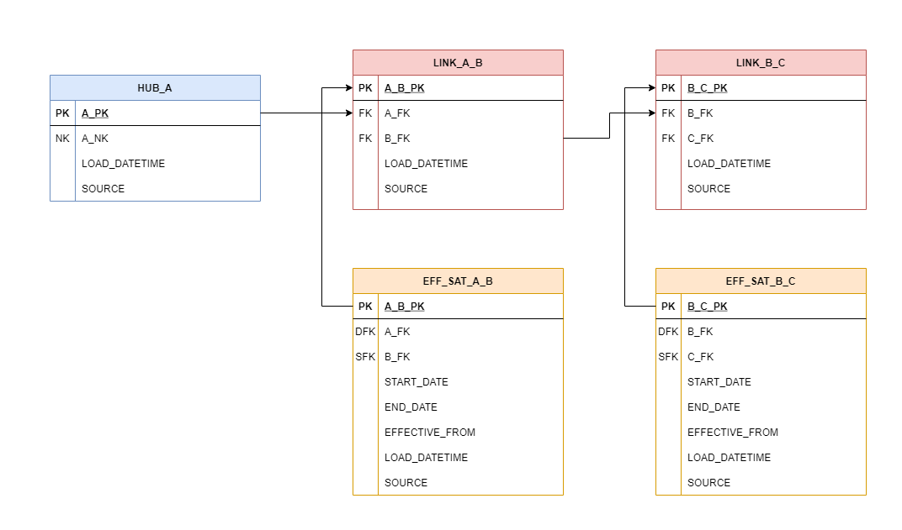

Bridge tables are query assistant tables that are part of the Business Vault. Similar to PIT tables, their purpose is
to improve performance of queries on the Raw Data Vault by reducing the number of required joins for such queries to 
simple equi-joins. A bridge table spans across a hub and one or more associated links. This means that it is essentially 
a specialised form of link table, containing hash keys from the hub and the links its spans. It does not contain 
information from satellites, however, it may contain computations and aggregations (according to grain) to increase 
query performance upstream when creating virtualised data marts. Bridge tables provide a timeline for valid sets of 
hub and link relationships for a given set of dates described in an [As of Date table](../macros.md#as-of-date-tables)

A basic bridge table model for a hub and two links:



#### Structure

Our bridge structures will contain:

##### Hub Table Name (source_model)
This is the name of the hub that contains the primary key (src_pk) and to which the links are connected to.

##### Primary Key (src_pk)
A primary key (or surrogate key) which is usually a hashed representation of the natural key. This will be the primary 
key used by the hub.

##### As of Date Table (as_of_dates_table) 
The As of Date table describes the history needed to construct the bridge table as a list of dates. This is where you 
would supply the name of your As of Date table.

##### Bridge Table Parameters (bridge_walk)
This is a dictionary of bridge table metadata subdivided into dictionaries for each link relationship. The metadata for 
each link relationship includes bridge table column aliases (bridge_xxxxx), link table name and foreign key column names 
(link_xxxxx), and the related effectivity satellite table details (eff_sat_xxxxx).

##### Stage Load Date Timestamps (stage_tables_ldts)
List of stage table load date timestamp columns. These are used to find the waterlevel, i.e. the latest date that hasn't 
yet been impacted by the stage table.

##### Hub Load Date Timestamp (src_ldts)
Hub load date timestamp column. This is used to distinguish new key relationships when compared to the waterlevel.

### Setting up bridge models

Create a new dbt model as before. We'll call this one `bridge_customer_order`. 

=== "bridge_customer_order.sql"

    ``` jinja
    {{ dbtvault.bridge(source_model=source_model, src_pk=src_pk,
                            src_ldts=src_ldts,
                            bridge_walk=bridge_walk,
                            as_of_dates_table=as_of_dates_table,
                            stage_tables_ldts=stage_tables_ldts) }}
    ```


To create a bridge model, we simply copy and paste the above template into a model named after the bridge table we
are creating. dbtvault will generate a bridge table using parameters provided in the following steps.

#### Materialisation

Bridge tables should use the `bridge_incremental` materialisation, as the bridge is remade with each new As of Date table. 

### Adding the metadata

Let's look at the metadata we need to provide to the [bridge](../macros.md#bridge) macro.

| Parameter         | Value                                                                    | 
| ----------------- | ------------------------------------------------------------------------ | 
| source_model      | HUB_CUSTOMER                                                             | 
| src_pk            | CUSTOMER_PK                                                              |
| src_ldts          | LOAD_DATETIME                                                            |
| as_of_dates_table | AS_OF_DATE                                                               |
| satellites        | {'CUSTOMER_ORDER':                                                       |
|                   | &emsp;&emsp;{'bridge_link_pk': 'LINK_CUSTOMER_ORDER_PK',                 | 
|                   | &emsp;&emsp;&nbsp;'bridge_end_date': 'EFF_SAT_CUSTOMER_ORDER_ENDDATE',   | 
|                   | &emsp;&emsp;&nbsp;'bridge_load_date': 'EFF_SAT_CUSTOMER_ORDER_LOADDATE', | 
|                   | &emsp;&emsp;&nbsp;'link_table': 'LINK_CUSTOMER_ORDER',                   | 
|                   | &emsp;&emsp;&nbsp;'link_pk': 'CUSTOMER_ORDER_PK',                        | 
|                   | &emsp;&emsp;&nbsp;'link_fk1': 'CUSTOMER_FK',                             | 
|                   | &emsp;&emsp;&nbsp;'link_fk2': 'ORDER_FK',                                | 
|                   | &emsp;&emsp;&nbsp;'eff_sat_table': 'EFF_SAT_CUSTOMER_ORDER',             |  
|                   | &emsp;&emsp;&nbsp;'eff_sat_pk': 'CUSTOMER_ORDER_PK',                     | 
|                   | &emsp;&emsp;&nbsp;'eff_sat_end_date': 'END_DATE',                        | 
|                   | &emsp;&emsp;&nbsp;'eff_sat_load_date': 'LOAD_DATETIME'},                 | 
|                   | &nbsp;'ORDER_PRODUCT':                                                         |
|                   | &emsp;&emsp;{'bridge_link_pk': 'LINK_ORDER_PRODUCT_PK',                  | 
|                   | &emsp;&emsp;&nbsp;'bridge_end_date': 'EFF_SAT_ORDER_PRODUCT_ENDDATE',    | 
|                   | &emsp;&emsp;&nbsp;'bridge_load_date': 'EFF_SAT_ORDER_PRODUCT_LOADDATE',  | 
|                   | &emsp;&emsp;&nbsp;'link_table': 'LINK_ORDER_PRODUCT',                    | 
|                   | &emsp;&emsp;&nbsp;'link_pk': 'ORDER_PRODUCT_PK',                         | 
|                   | &emsp;&emsp;&nbsp;'link_fk1': 'ORDER_FK',                                | 
|                   | &emsp;&emsp;&nbsp;'link_fk2': 'PRODUCT_FK',                              | 
|                   | &emsp;&emsp;&nbsp;'eff_sat_table': 'EFF_SAT_ORDER_PRODUCT',              |  
|                   | &emsp;&emsp;&nbsp;'eff_sat_pk': 'ORDER_PRODUCT_PK',                      | 
|                   | &emsp;&emsp;&nbsp;'eff_sat_end_date': 'END_DATE',                        | 
|                   | &emsp;&emsp;&nbsp;'eff_sat_load_date': 'LOAD_DATETIME'}}                 | 
| stage_tables_ldts | {'STG_CUSTOMER_ORDER': 'LOAD_DATETIME',                                  |
|                   | &nbsp;'STG_CUSTOMER_PRODUCT': 'LOAD_DATETIME'}                           |


#### Source table

Here we will define the metadata for the source_model. We will use the HUB_CUSTOMER that we built before.

=== "bridge_customer_order.sql"

    ```yaml
    
    source_model: "HUB_CUSTOMER"
    ...
    ```

#### Source columns

Next we need to choose which source columns we will use in our `BRIDGE_CUSTOMER_ORDER`:

1. The primary key of the parent hub, which is a hashed natural key. 
The `CUSTOMER_PK` we created earlier in the [hub](tut_hubs.md) section will be used for `BRIDGE_CUSTOMER_ORDER` as the origin Primary Key.

2. `LOAD_DATETIME` column which represents the load date timestamp the `CUSTOMER_PK` is valid for.

=== "bridge_customer_order.sql"

    ```yaml
    
    source_model: "HUB_CUSTOMER"
    src_pk: "CUSTOMER_PK"
    src_ldts: "LOAD_DATETIME"
    ...
    ```

#### As of Date Table

The As of Date table is the source information of the [As of Dates](tut_as_of_date.md).
This will provide the dates for which to generate the bridge table.

Here we name our As of Date table `AS_OF_DATE`. 

=== "bridge_customer_order.sql"

    ```yaml
    
    source_model: "HUB_CUSTOMER"
    src_pk: "CUSTOMER_PK"
    src_ldts: "LOAD_DATETIME"
    as_of_dates_table: "AS_OF_DATE"
    ...
    ```

#### Bridge table parameters (`bridge_walk`)

Finally, we need to choose which links to incorporate in our `BRIDGE_CUSTOMER_ORDER`. 

Below there are described the different bridge aliases, links table and column names, effectivity satellite table and column names associated with one of the link - effectivity satellite pair (`CUSTOMER_ORDER`).

1. The `LINK_CUSTOMER_ORDER_PK` will be the alias for the Primary Key column of the `LINK_CUSTOMER_ORDER` link inside the `BRIDGE_CUSTOMER_ORDER` tables.
2. The `EFF_SAT_CUSTOMER_ORDER_ENDDATE` is the bridge alias for the `END_DATE` column of `LINK_CUSTOMER_ORDER` link.
3. The `EFF_SAT_CUSTOMER_ORDER_LOADDATE` is the bridge alias for the `LOAD_DATE` column of `LINK_CUSTOMER_ORDER` link.
4. The full table name of the link connecting the Customer and Order hubs is `LINK_CUSTOMER_ORDER`.
5. The name of the Primary Key column of `LINK_CUSTOMER_ORDER` is `CUSTOMER_ORDER_PK`.   
6. The first Foreign Key is `CUSTOMER_FK`.
7. The second Foreign Key is `ORDER_FK`.
8. The full table name of the associated effectivity satellite is `EFF_SAT_CUSTOMER_ORDER`.
9. The Primary Key of the `EFF_SAT_CUSTOMER_ORDER` table is the same as of the parent link: `CUSTOMER_ORDER_PK`
10. The name of the column inside the `EFF_SAT_CUSTOMER_ORDER` table describing the timestamp when a `CUSTOMER_ORDER` relationship ended is `END_DATE`.  
11. The name of the column inside the `EFF_SAT_CUSTOMER_ORDER` table recording the load date/timestamp of a `CUSTOMER_ORDER` relationship is `LOAD_DATE`.

In a similar fashion, continue defining the different aliases for the `ORDER_PRODUCT` link and effectivity satellite columns. 

The dbt_project.yml below only defines two link relationships but to add others you would follow the same method inside 
the bridge_walk metadata. For instance, it can be seen where the `PRODUCT_COMPONENT` relationship metadata would begin.

=== "bridge_customer_order.sql"

    ```yaml
    
    source_model: "HUB_CUSTOMER"
    src_pk: "CUSTOMER_PK"
    src_ldts: "LOAD_DATETIME"
    as_of_dates_table: "AS_OF_DATE"
    bridge_walk:
        CUSTOMER_ORDER:
            bridge_link_pk: "LINK_CUSTOMER_ORDER_PK"
            bridge_end_date: "EFF_SAT_CUSTOMER_ORDER_ENDDATE"
            bridge_load_date: "EFF_SAT_CUSTOMER_ORDER_LOADDATE"
            link_table: "LINK_CUSTOMER_ORDER"
            link_pk: "CUSTOMER_ORDER_PK"
            link_fk1: "CUSTOMER_FK"
            link_fk2: "ORDER_FK"
            eff_sat_table: "EFF_SAT_CUSTOMER_ORDER"
            eff_sat_pk: "CUSTOMER_ORDER_PK"
            eff_sat_end_date: "END_DATE"
            eff_sat_load_date: "LOAD_DATETIME"
        ORDER_PRODUCT:
            bridge_link_pk: "LINK_ORDER_PRODUCT_PK"
            bridge_end_date: "EFF_SAT_ORDER_PRODUCT_ENDDATE"
            bridge_load_date: "EFF_SAT_ORDER_PRODUCT_LOADDATE"
            link_table: "LINK_ORDER_PRODUCT"
            link_pk: "ORDER_PRODUCT_PK"
            link_fk1: "ORDER_FK"
            link_fk2: "PRODUCT_FK"
            eff_sat_table: "EFF_SAT_ORDER_PRODUCT"
            eff_sat_pk: "ORDER_PRODUCT_PK"
            eff_sat_end_date: "END_DATE"
            eff_sat_load_date: "LOAD_DATETIME"
    ...
    ```

#### Stage metadata 

Finally, we add the Links & Effectivity Satellites stage table names and their Load Date/Timestamp column name. 

=== "bridge_customer_order.sql"

    ```yaml
    
    source_model: "HUB_CUSTOMER"
    src_pk: "CUSTOMER_PK"
    src_ldts: "LOAD_DATETIME"
    as_of_dates_table: "AS_OF_DATE"
    bridge_walk:
        CUSTOMER_ORDER:
            bridge_link_pk: "LINK_CUSTOMER_ORDER_PK"
            bridge_end_date: "EFF_SAT_CUSTOMER_ORDER_ENDDATE"
            bridge_load_date: "EFF_SAT_CUSTOMER_ORDER_LOADDATE"
            link_table: "LINK_CUSTOMER_ORDER"
            link_pk: "CUSTOMER_ORDER_PK"
            link_fk1: "CUSTOMER_FK"
            link_fk2: "ORDER_FK"
            eff_sat_table: "EFF_SAT_CUSTOMER_ORDER"
            eff_sat_pk: "CUSTOMER_ORDER_PK"
            eff_sat_end_date: "END_DATE"
            eff_sat_load_date: "LOAD_DATETIME"
        ORDER_PRODUCT:
            bridge_link_pk: "LINK_ORDER_PRODUCT_PK"
            bridge_end_date: "EFF_SAT_ORDER_PRODUCT_ENDDATE"
            bridge_load_date: "EFF_SAT_ORDER_PRODUCT_LOADDATE"
            link_table: "LINK_ORDER_PRODUCT"
            link_pk: "ORDER_PRODUCT_PK"
            link_fk1: "ORDER_FK"
            link_fk2: "PRODUCT_FK"
            eff_sat_table: "EFF_SAT_ORDER_PRODUCT"
            eff_sat_pk: "ORDER_PRODUCT_PK"
            eff_sat_end_date: "END_DATE"
            eff_sat_load_date: "LOAD_DATETIME"
    stage_tables_ldts:
        STG_CUSTOMER_ORDER: "LOAD_DATETIME"
        STG_ORDER_PRODUCT: "LOAD_DATETIME"
     
    ```

In the end, our model should look like the following: 

=== "bridge_customer_order.sql"

    ```yaml
    {{ config(materialized='bridge_incremental') }}

    
    source_model: "HUB_CUSTOMER"
    src_pk: "CUSTOMER_PK"
    src_ldts: "LOAD_DATETIME"
    as_of_dates_table: "AS_OF_DATE"
    bridge_walk:
        CUSTOMER_ORDER:
            bridge_link_pk: "LINK_CUSTOMER_ORDER_PK"
            bridge_end_date: "EFF_SAT_CUSTOMER_ORDER_ENDDATE"
            bridge_load_date: "EFF_SAT_CUSTOMER_ORDER_LOADDATE"
            link_table: "LINK_CUSTOMER_ORDER"
            link_pk: "CUSTOMER_ORDER_PK"
            link_fk1: "CUSTOMER_FK"
            link_fk2: "ORDER_FK"
            eff_sat_table: "EFF_SAT_CUSTOMER_ORDER"
            eff_sat_pk: "CUSTOMER_ORDER_PK"
            eff_sat_end_date: "END_DATE"
            eff_sat_load_date: "LOAD_DATETIME"
        ORDER_PRODUCT:
            bridge_link_pk: "LINK_ORDER_PRODUCT_PK"
            bridge_end_date: "EFF_SAT_ORDER_PRODUCT_ENDDATE"
            bridge_load_date: "EFF_SAT_ORDER_PRODUCT_LOADDATE"
            link_table: "LINK_ORDER_PRODUCT"
            link_pk: "ORDER_PRODUCT_PK"
            link_fk1: "ORDER_FK"
            link_fk2: "PRODUCT_FK"
            eff_sat_table: "EFF_SAT_ORDER_PRODUCT"
            eff_sat_pk: "ORDER_PRODUCT_PK"
            eff_sat_end_date: "END_DATE"
            eff_sat_load_date: "LOAD_DATETIME"
    stage_tables_ldts:
        STG_CUSTOMER_ORDER: "LOAD_DATETIME"
        STG_ORDER_PRODUCT: "LOAD_DATETIME"
    

    
    
    
    
    
    
    
    
    

    

    

    {{ dbtvault.bridge(source_model=source_model, src_pk=src_pk,
                            src_ldts=src_ldts,
                            bridge_walk=bridge_walk,
                            as_of_dates_table=as_of_dates_table,
                            stage_tables_ldts=stage_tables_ldts) }}
    ```

### Running dbt

In order to finalise the creation of the `bridge_customer_order` table we use the following dbt command:

=== "< dbt v0.20.x"
    `dbt run -m +bridge_customer_order`

=== "> dbt v0.21.0"
    `dbt run --select +bridge_customer_order`

The resulting Bridge table should look like this:

 | CUSTOMER_PK | AS_OF_DATE              | LINK_CUSTOMER_ORDER_PK | LINK_ORDER_PRODUCT_PK |
 | ----------- | ----------------------- | ---------------------- | --------------------- |
 | ED5984...   | 2018-06-01 00:00:00.000 | A77BA1...              | 8A2CQA...             |
 | .           | .                       | .                      | .                     |
 | .           | .                       | .                      | .                     |
 | M67Y0U...   | 2018-06-01 12:00:00.000 | 1FA79C...              | BH5674...             |
