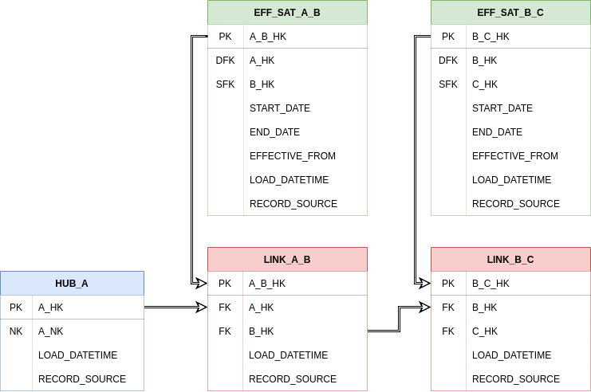

Bridge tables are query assistant tables that form part of the Business Vault. Similar to PIT tables, their purpose is
to improve performance of queries on the Raw Data Vault by reducing the number of required joins for such queries to 
simple equi-joins. A bridge table spans across a hub and one or more associated links. This means that it is essentially 
a specialised form of link table, containing hash keys from the hub and the links its spans. It does not contain 
information from satellites, however, it may contain computations and aggregations (according to grain) to increase 
query performance upstream when creating virtualised data marts. Bridge tables provide a timeline for valid sets of 
hub and link relationships for a given set of dates described in an [as of dates table](../macros.md#As-Of-Date-Table-Structures)

A basic bridge table model for a hub and two links:



### Structure

Our bridge structures will contain:

##### Primary Key (src_pk)
A primary key (or surrogate key) which is usually a hashed representation of the natural key. This will be the primary 
key used by the hub.

##### AS_OF Table (as_of_dates_table) 
The as_of_dates_table describes the history needed to construct the bridge table as a list of dates. This is where you 
would supply the name of your as of date table.

##### Bridge Table Parameters (bridge_walk)
This is a dictionary of bridge table metadata subdivided into dictionaries for each link relationship. The metadata for 
each link relationship includes bridge table column aliases (bridge_xxxxx), link table name and foreign key column names 
(link_xxxxx), and the related effectivity satellite table details (eff_sat_xxxxx).

##### Hub Table Name (source_model)
This is the name of the hub that contains the primary key (src_pk) and that the links are connected to. 

##### Stage Load Date Timestamps (stage_tables_ldts)
List of stage table load date timestamp columns. These are used to find the waterlevel, i.e. the latest date that hasn't 
yet been impacted by the stage table.

##### Hub Load Date Timestamp (src_ldts)
Hub load date timestamp column. This is used to distinguish new key relationships when compared to the waterlevel.

### Setting up bridge models

Create a new dbt model as before. We'll call this one `bridge_customer_order`. 

`bridge_customer_order.sql`
```jinja
{{ {{ dbtvault.bridge({src_pk}, {as_of_dates_table}, {bridge_walk}, 
    {source_model}, {stage_tables}, {src_ldts}) }} }}
```

To create a bridge model, we simply copy and paste the above template into a model named after the bridge table we
are creating. dbtvault will generate a bridge table using parameters provided in the following steps.

Bridge tables should use the bridge_incremental materialization, as the bridge is remade with each new as of dates table. 

We recommend setting the `bridge_incremental` materialization on all of your bridges using the `dbt_project.yml` file:

`dbt_project.yml`
```yaml
models:
  my_dbtvault_project:
    bridge:
    materialized: bridge_incremental
    tags:
      - bridge
    bridge_customer_order:
      vars:
        ...
```

### Adding the metadata

Let's look at the metadata we need to provide to the [bridge](../macros.md#bridge) macro.

#### Source table
Here we will define the metadata for the source_model. We will use the HUB_CUSTOMER that we built before.

`dbt_project.yml`
```yaml
    BRIDGE_CUSTOMER_ORDER:
      vars:
        source_model: HUB_CUSTOMER
        ...
```

#### Source columns

Next we need to choose which source columns we will use in our `BRIDGE_CUSTOMER_ORDER`:

1. The primary key of the parent hub, which is a hashed natural key. 
The `CUSTOMER_PK` we created earlier in the [hub](tut_hubs.md) section will be used for `BRIDGE_CUSTOMER_ORDER`.

2. `AS_OF_DATES_TABLE` is the source information of the [as of dates table](../macros.md#As-Of-Date-Table-Structures).
This will provide the dates for which to generate the bridge table.

3. `LOAD_DATETIME` column which represents the load date timestamp the row is valid for

`dbt_project.yml`
```yaml
    BRIDGE_CUSTOMER_ORDER:
      vars:
        source_model: HUB_CUSTOMER
        src_pk: "CUSTOMER_PK"
        src_ldts: "LOAD_DATETIME"
        as_of_dates_table: "AS_OF_DATE"
        ...
```

#### Bridge table parameters (`bridge_walk`)

Finally we need to choose which links to incorporate in our `BRIDGE_CUSTOMER_ORDER`.

The dbt_project.yml below only defines two link relationships but to add others you would follow the same method inside 
the bridge_walk metadata. For instance, it can be seen where the PRODUCT_COMPONENT relationship metadata would begin.

`dbt_project.yml`
```yaml
    BRIDGE_CUSTOMER_ORDER:
      vars:
        source_model: "HUB_CUSTOMER"
        src_pk: "CUSTOMER_PK"
        src_ldts: "LOAD_DATETIME"
        as_of_dates_table: "AS_OF_DATE"
        bridge_walk:
            CUSTOMER_ORDER:
                bridge_link_pk: "LINK_CUSTOMER_ORDER_PK"
                bridge_start_date: "EFF_SAT_CUSTOMER_ORDER_STARTDATE"
                bridge_end_date: "EFF_SAT_CUSTOMER_ORDER_ENDDATE"
                bridge_load_date: "EFF_SAT_CUSTOMER_ORDER_LOADDATE"
                link_table: "LINK_CUSTOMER_ORDER"
                link_pk: "CUSTOMER_ORDER_PK"
                link_fk1: "CUSTOMER_FK"
                link_fk2: "ORDER_FK"
                eff_sat_table: "EFF_SAT_CUSTOMER_ORDER"
                eff_sat_pk: "CUSTOMER_ORDER_PK"
                eff_sat_start_date: "START_DATE"
                eff_sat_end_date: "END_DATE"
                eff_sat_load_date: "LOAD_DATETIME"
            ORDER_PRODUCT:
                bridge_link_pk: "LINK_ORDER_PRODUCT_PK"
                bridge_start_date: "EFF_SAT_ORDER_PRODUCT_STARTDATE"
                bridge_end_date: "EFF_SAT_ORDER_PRODUCT_ENDDATE"
                bridge_load_date: "EFF_SAT_ORDER_PRODUCT_LOADDATE"
                link_table: "LINK_ORDER_PRODUCT"
                link_pk: "ORDER_PRODUCT_PK"
                link_fk1: "ORDER_FK"
                link_fk2: "PRODUCT_FK"
                eff_sat_table: "EFF_SAT_ORDER_PRODUCT"
                eff_sat_pk: "ORDER_PRODUCT_PK"
                eff_sat_start_date: "START_DATE"
                eff_sat_end_date: "END_DATE"
                eff_sat_load_date: "LOAD_DATETIME"
            PRODUCT_COMPONENT:
                ...
        stage_tables_ldts:
            STG_CUSTOMER_ORDER: "LOAD_DATETIME"
            STG_ORDER_PRODUCT: "LOAD_DATETIME"
        ...
```

### Running dbt

`dbt run -m +bridge_customer_order`
