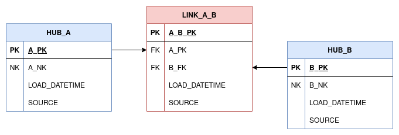

Effectivity Satellites are built on Links and record the time period when the corresponding link records
start and end effectivity. The next section will explore the need for effectivity satellites and explain some of the 
logic around their implementation. 

### The Driving Key problem and why we have Effectivity Satellites

Say we have a Table A. Table A contains a column which is a foreign key link to a Table B. In the Data Vault we model
this as a Link, as follows:



The link has no from and to dates, it declares that there is a link between A and B for a reason, that is all. 
To solve this, we create an Effectivity Satellite off `LINK_A_B`, `EFF_SAT_A_B`. This contains information about 
the status of `LINK_A_B`. Now we have two columns, `START_DATE` and `END_DATE`. When the Effectivity Satellite
record is created, we set the `START_DATE` and leave the `END_DATE` empty, or in our case set it to the maximal date of
`9999-31-12` to signify that the relationship is will not expire - it is active, or 'open'.

Now imagine, the foreign key link in Table A changes for some reason, pointing to another record in Table B. 
The foreign key column in the row changes to point to the new record, it no longer points to the old record. This
gives us two items of information: the new key and the ending of the old key, perhaps we have an order, and we want to 
change who placed the order.

The load will create a new `EFF_SAT_A_B` record. The old record now needs to be end-dated so that we do not have 2 open
Link records. Ideally, we should end-date the original link relationship inside the same transaction to avoid 2 SQL queries
and possibly de-syncing. 

In any Link there are two FK columns, one will change over tme and the other will remain constant. The one that does not change
is called the **driving key** and the one that does change is called the **driven key** (or secondary key).

### Structure

Our effectivity satellites will contain:

##### Primary Key (src_pk)
A primary key (or surrogate key) which is usually a hashed representation of the natural key.
For an effectivity satellite, this should be the same as the corresponding link's PK.

##### Driving Foreign Key (src_dfk)

The driving foreign key stores the primary key of the associated link, which will remain constant over time.

For example, in a relationship between a customer and an order, the order will always have occurred, but the customer
attached to the order may change over time if the order is amended. In this case the DFK would be the `ORDER_PK` 
(Derived from the `ORDER_ID`).

More on driving keys is described below.

##### Secondary Foreign Key (src_sfk)

The secondary foreign key stores the primary key of the associated link, which is likely to change over time.

As per the example in the DFK section above, this would be the `CUSTOMER_PK`, derived from the `CUSTOMER_ID`. 

##### Start Date (src_start_date)

The start date (along with the end date) form the effectivity satellite payload, and is metadata related to the corresponding 
link table. The start date is the start date of the relationship in the link, which is being tracked by the 
effectivity satellite. 

It is important to note than whilst this is usually the same or initialised to the same source data
as the `EFFECTIVE_FROM`, there can be divergence over time. The start date tracks the start date of the link, whilst
`EFFECTIVE_FROM` tracks the date that the effectivity satellite recorded a change in the relationship in the link. 

##### End Date (src_end_date)

The end date also forms part of the effectivity satellite payload, and is metadata related to the corresponding 
link table, in the same way the start date is.

In cases of 1-1 and 1-M (One to many) relationships, this can usually be inferred. Unfortunately, 
with M-M (Many to Many) relationships, it becomes impossible to infer the end date between a pair of specific 
business entities, so we must explicitly define it and track the end date separately. 

##### Effective From (src_eff)
An effectivity date. Usually called `EFFECTIVE_FROM`, this column is the business effective date of a 
satellite record. It records that a record is valid from a specific point in time.
If the link relationship changes, then the record with the old relation should no longer be valid, and it will no 
longer have the most recent `EFFECTIVE_FROM` value. 

##### Load date (src_ldts)
A load date or load date timestamp. This identifies when the record was first loaded into the database.

##### Record Source (src_source)
The source for the record. This can be a code which is assigned to a source name in an external lookup table, 
or a string directly naming the source system.

!!! note
    `LOAD_DATE` is the time the record is loaded into the database. `EFFECTIVE_FROM` is different, 
    holding the business effectivity date of the record (i.e. When it actually happened in the real world) and will usually 
    hold a different value, especially if there is a batch processing delay between when a business event happens and the 
    record arriving in the database for load. Having both dates allows us to ask the questions 'what did we know when' 
    and 'what happened when' using the `LOAD_DATE` and `EFFECTIVE_FROM` date accordingly. 

### Setting up effectivity satellite models

Create a new dbt model as before. We'll call this one `eff_sat_customer_order`. 

`eff_sat_customer_nation.sql`
```jinja
{{ dbtvault.eff_sat(var('src_pk'), var('src_dfk'), var('src_sfk'),
                    var('src_start_date'), var('src_end_date'),
                    var('src_eff'), var('src_ldts'), var('src_source'),
                    var('source_model')) }}
```

To create an effectivity satellite model, we simply copy and paste the above template into a model named after the effectivity
satellite we are creating. dbtvault will generate an effectivity satellite using parameters provided in the next steps.

Effectivity Satellites should use the incremental materialization, as we load and add new records to the existing data set. 

We recommend setting the `incremental` materialization on all of your satellites using the `dbt_project.yml` file:

`dbt_project.yml`
```yaml
models:
  my_dbtvault_project:
   satellites:
    materialized: incremental
    tags:
      - sat
    sat_customer_details:
      vars:
        ...
    sat_booking_details:
      vars:
        ...
```

!!! tip "New in dbtvault v0.7.0"
    You may also use the [vault_insert_by_period](../macros.md#vault_insert_by_period) materialisation, a custom materialisation 
    included with dbtvault which enables you to iteratively load a table using a configurable period of time (e.g. by day). 

### Adding the metadata

Let's look at the metadata we need to provide to the [eff_sat](../macros.md#eff_sat) macro.

#### Source table

The first piece of metadata we need is the source table. This step is easy, as in this example we created the 
staging layer ourselves.  All we need to do is provide the name of stage table as a string in our metadata 
as follows.

`dbt_project.yml`
```yaml
eff_sat_customer_nation:
  vars:
    source_model: 'stg_customer_hashed'
```

!!! info
    This is just one way of providing metadata/parameter values to dbtvault macros, take a look at 
    the [Metadata Reference](../metadata.md) for some alternatives
    
#### Source columns

Next, we define the columns which we would like to bring from the source.
Using our knowledge of what columns we need in our `eff_sat_customer_nation` table, we can identify columns in our
staging layer which map to them:

1. The primary key of the parent link table, which is a hashed natural key. 
The `CUSTOMER_NATION_PK` we created earlier in the [staging](tut_staging.md) section will be used for `eff_sat_customer_nation`.
2. The `CUSTOMER_PK` column. This will be our driving key.
3. The `NATION_PK` column. This will be our secondary key.
4. A `START_DATE` column. This should be initialised to the same value as the `EFFECTIVE_FROM` column. 
5. An `END_DATE` column. This should be initialised to the maximal date (`9999-31-12`), to signify an open link record (i.e. An active relationship)
6. An `EFFECTIVE_FROM` column, also added in staging. 
7. A load date timestamp, which is present in the staging layer as `LOAD_DATE`. 
8. A `SOURCE` column.

We can now add this metadata to the `dbt_project.yml`:

`dbt_project.yml`
```yaml hl_lines="4 5 6 7 8 9 10 11 12"
eff_sat_customer_nation:
  vars:
    source_model: 'stg_customer_hashed'
    src_pk: 'CUSTOMER_NATION_PK'
    src_dfk: 'CUSTOMER_PK'
    src_sfk: 'NATION_PK'
    src_start_date: 'START_DATE'
    src_end_date: 'END_DATE'
    src_eff: 'EFFECTIVE_FROM'
    src_ldts: 'LOAD_DATE'
    src_source: 'SOURCE'
```

### Running dbt

With our model complete and our YAML written, we can run dbt to create our `eff_sat_customer_nation` effectivity satellite.

`dbt run -m +eff_sat_customer_nation`
    
And our table will look like this:

 | CUSTOMER_NATION_PK | CUSTOMER_PK  | NATION_PK     | START_DATE | END_DATE   | EFFECTIVE_FROM | LOAD_DATE    | SOURCE |
 | ------------------ | ------------ | ------------- | ---------- | ---------- | -------------- | ------------ | ------ |
 | 3C5984...          | B8C37E...    | 79CBA1...     | 1993-01-01 | 9999-31-12 | 1993-01-01     | 1993-01-01   | 1      |
 | .                  | .            | .             | .          | .          | .              | .            | 1      |
 | .                  | .            | .             | .          | .          | .              | .            | 1      |
 | D8CB1F...          | FED333...    | 8FAA77...     | 1993-01-01 | 9999-31-12 | 1993-01-01     | 1993-01-01   | 1      |


### Next steps

We have now created:

- A staging layer 
- A Hub 
- A Link
- A Transactional Link
- A Satellite
- An Effectivity Satellite

That is all for now. More table types will be coming in future! See our [roadmap](../roadmap.md) for more details.

If you want a more realistic real-world example, with real data to work with, take a look at our [worked example](../worked_example/we_worked_example.md).