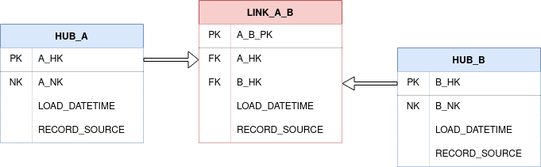

Effectivity Satellites are built on Links and record the time period when the corresponding Link records
start and end effectivity. The next section will explore the need for Effectivity Satellites and explain why we
have them and how they work.

### The Driving Key problem and why we have Effectivity Satellites

Say we have a Table A. Table A contains a column which is a foreign key link to a Table B. In the Data Vault we model
this as a Link, as follows:



A Link does not have any temporal data; it declares that there is a relationship between A and B, but nothing about when or for how long.

To solve this, we create an Effectivity Satellite from `LINK_A_B` called `EFF_SAT_A_B`. This contains information about 
the status of `LINK_A_B`. Now we have two columns, `START_DATE` and `END_DATE`. When the Effectivity Satellite
record is created, we set the `START_DATE` and leave the `END_DATE` empty, or in our case set it to the maximal date of
`9999-31-12` to signify that the relationship will not expire - it is active, or 'open'.

Now imagine, the foreign key link in Table A changes for some reason, pointing to another record in Table B. 
The foreign key column in the row changes to point to the new record and it no longer points to the old record. This
gives us two important pieces of information: the new key and the fact that the old key is no longer valid.

Perhaps we have a booking for a hotel room which has been cancelled, and we want to change the booking. 

The load will create a new `EFF_SAT_A_B` record. The old record now needs to be end-dated so that we do not have 2 open
Link records. Ideally, we should end-date the original Link relationship inside the same transaction to avoid 2 SQL queries
and possible de-syncing. 

In any Link there are two FK columns, one will change over time and the other will remain constant. The one that does not change
is called the **driving key** and the one that does change is called the **driven key** (or secondary key).

### Structure

An Effectivity Satellite contains:

#### Primary Key (src_pk)
A primary key (or surrogate key) which is usually a hashed representation of the natural key.
For an Effectivity Satellite, this should be the same as the corresponding link's PK.

#### Driving Foreign Key (src_dfk)

The driving foreign key stores the primary key of one of the associated Hubs to the parent Link, which will remain constant over time.

For example, in a relationship between a customer and an order, the order will always have occurred, but the customer
attached to the order may change over time if the order is amended. In this case the DFK would be the `ORDER_HK` 
(Derived from the `ORDER_ID`).

More on the concept of driving keys is described above.

#### Secondary Foreign Key (src_sfk)

The secondary foreign key stores the primary key of one of the associated Hubs to the parent Link, which is likely to change over time.

As per the example in the DFK section above, this would be the `CUSTOMER_HK`, derived from the `CUSTOMER_ID`. 

#### Start Date (src_start_date)

The start date (along with the end date) form the Effectivity Satellite payload, and is metadata related to the corresponding 
Link table. The start date is the start date of the relationship in the Link, which is being tracked by the 
Effectivity Satellite. 

It is important to note than whilst this is usually the same or initialised to the same source data
as the `EFFECTIVE_FROM`, there can be divergence over time. The start date tracks the start date of the link, whilst
`EFFECTIVE_FROM` tracks the date that the Effectivity Satellite recorded a change in the relationship in the Link. 

#### End Date (src_end_date)

The end date also forms part of the effectivity satellite payload, and is metadata related to the corresponding 
Link table, in the same way the start date is.

In cases of 1-1 and 1-M (One to many) relationships, this can usually be inferred. Unfortunately, 
with M-M (Many to Many) relationships, it becomes impossible to infer the end date between a pair of specific 
business entities, so we must explicitly define it and track the end date separately. 

#### Effective From (src_eff)
An effectivity date. Usually called `EFFECTIVE_FROM`, this column is the business effective date of a 
satellite record. It records that a record is valid from a specific point in time.
If the link relationship changes, then the record with the old relation should no longer be valid, and it will no 
longer have the most recent `EFFECTIVE_FROM` value. 

#### Load date (src_ldts)
A load date or load date timestamp. This identifies when the record was first loaded into the database.

#### Record Source (src_source)
The source for the record. This can be a code which is assigned to a source name in an external lookup table, 
or a string directly naming the source system.

### Load date vs. Effective From Date
`LOAD_DATE` is the time the record is loaded into the database. `EFFECTIVE_FROM` is different, 
holding the business effectivity date of the record (i.e. When it actually happened in the real world) and will usually 
hold a different value, especially if there is a batch processing delay between when a business event happens and the 
record arriving in the database for load. Having both dates allows us to ask the questions 'what did we know when' 
and 'what happened when' using the `LOAD_DATE` and `EFFECTIVE_FROM` date accordingly. 

The `EFFECTIVE_FROM` field is **not** part of the Data Vault 2.0 standard, and as such it is an optional field, however,
in our experience we have found it useful for processing and applying business rules in downstream Business Vault, for 
use in presentation layers.

### Creating effectivity satellite models

Create a new dbt model as before.

=== "eff_sat_customer_nation.sql"

    ```jinja
    {{ dbtvault.eff_sat(src_pk=src_pk, src_dfk=src_dfk, src_sfk=src_sfk,
                        src_start_date=src_start_date, src_end_date=src_end_date,
                        src_eff=src_eff, src_ldts=src_ldts, src_source=src_source,
                        source_model=source_model) }}
    ```

To create an Effectivity Satellite model, we simply copy and paste the above template into a model named after the Effectivity
Satellite we are creating. dbtvault will generate an Effectivity Satellite using parameters provided in the next steps.

#### Materialisation

The recommended materialisation for **Effectivity Satellites** is `incremental`, as we load and add new records to the existing data set. 

### Adding the metadata 

Let's look at the metadata we need to provide to the [eff_sat](../macros.md#eff_sat) macro. 

See our [metadata reference](../metadata.md#effectivity-satellites) for more detail on how to provide metadata.

We provide the column names which we would like to select from the staging area (`source_model`).

Using our [knowledge](#structure) of what columns we need in our `eff_sat_customer_nation` Effectivity Satellite, we can identify columns in our
staging layer which map to them:

| Parameter      | Value               | 
| -------------- | ------------------- | 
| source_model   | v_stg_orders        | 
| src_pk         | CUSTOMER_NATION_HK  | 
| src_dfk        | CUSTOMER_HK         | 
| src_sfk        | NATION_HK           | 
| src_start_date | START_DATE          | 
| src_end_date   | END_DATE            | 
| src_eff        | EFFECTIVE_FROM      | 
| src_ldts       | LOAD_DATETIME       | 
| src_source     | RECORD_SOURCE       |

When we provide the metadata above, our model should look like the following:

=== "eff_sat_customer_nation.sql"

    ```jinja
    {{ config(materialized='incremental')  }}
    
    
    
    
    
    
    
    
    
    
    
    
    {{ dbtvault.eff_sat(src_pk=src_pk, src_dfk=src_dfk, src_sfk=src_sfk,
                        src_start_date=src_start_date, 
                        src_end_date=src_end_date,
                        src_eff=src_eff, src_ldts=src_ldts, 
                        src_source=src_source,
                        source_model=source_model) }}
    ```

### Running dbt

With our metadata provided and our model complete, we can run dbt to create `eff_sat_customer_nation` 
Effectivity Satellite, as follows:

=== "< dbt v0.20.x"
    `dbt run -m +eff_sat_customer_nation`

=== "> dbt v0.21.0"
    `dbt run --select +eff_sat_customer_nation`

And the resulting Effectivity Satellite table will look like this:

| CUSTOMER_NATION_HK | CUSTOMER_HK  | NATION_HK     | START_DATE              | END_DATE                | EFFECTIVE_FROM          | LOAD_DATETIME            | SOURCE |
| ------------------ | ------------ | ------------- | ----------------------- | ----------------------- | ----------------------- | ------------------------ | ------ |
| 3C5984...          | B8C37E...    | 79CBA1...     | 1993-01-01 00:00:00.000 | 9999-31-12 00:00:00.000 | 1993-01-01 00:00:00.000 | 1993-01-01 00:00:00.000  | 1      |
| .                  | .            | .             | .                       | .                       | .                       | .                        | 1      |
| .                  | .            | .             | .                       | .                       | .                       | .                        | 1      |
| D8CB1F...          | FED333...    | 8FAA77...     | 1993-01-01 00:00:00.000 | 9999-31-12 00:00:00.000 | 1993-01-01 00:00:00.000 | 1993-01-01 00:00:00.000  | 1      |