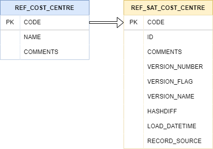

Reference tables are Hub-like structures which are used in Data Vault to store a usually static reference
to commonly used data throughout the organisation, usually in reports or business logic.

This is different from a Hub - A hub stores a list of unique values related to a business concept whereas a Reference
Table
stores a list of unique values related to non-business concepts.

A few examples of data that might belong in a reference table instead of a Hub include:

- Country Names
- Locations
- Codes (e.g. Airport Short Codes)
- Categories of something
- Calendar dates

It is important to understand that a reference table is not necessarily always the best approach in storing a
reference to this kind of data, and in some cases it may be more appropriate to model the data as a an attribute on a
SSatellite.

This is usually the case when the attribute in question is related to a Hub you have already identified in a model.

### Types of Reference Tables

In general, there are two main types of reference table:

- Non-historised Reference Tables
- Historised Reference tables

#### Non-historised Reference Tables (Also known as Reference Hubs)

A non-historised reference table is simply a table which holds a static list of appropriate reference data e.g.

| CODE | NAME                    | COMMENTS               |
|------|-------------------------|------------------------|
| ...  | ...                     | ...                    |
| LCY  | London City Airport     | Only a single runway   |
| LHR  | London Heathrow Airport |                        |
| LGW  | London Gatwick Airport  | Actually in Sussex     |
| LTN  | Luton Airport           | Not really London      |
| STN  | London Stansted Airport | Also not really London |

#### Historised Reference Tables (Also known as Reference Satellites)

Historised reference tables are actually a combination of two tables: A Reference Table (non-historised, as above) 
with a Satellite hanging off of it. This provides the means to track the changes in Reference Data over time.

These are less common than Non-historised Reference Tables, as often most reference data is static (unchanging). 

Some examples of Historised Reference data are below:

- Cost Centres - May change with the business as new mergers occur or subsidiaries are sold 
- Sales Region - May change with the business as different regions are expanded to 

<figure markdown>

  

</figure>

### Structure

Reference Tables are very diverse in their schemas and structures as they depend heavily on the kind of 
of references being stored. AutomateDV implements a very generic approach to Reference tables, allowing as much flexibility to the user as possible.

#### Primary Key (src_pk)

The primary for a reference table in most instances is a code which identifies the reference data. 
In the Airport example above, this would be the `Code` column, which is the identifier for the Airport record. 

!!! note
    It is important to note here that the PK of a Reference table is not a hash key, it is the natural identifier for a reference data record.

#### Extra Columns (src_extra_columns) - Optional

This parameter simply takes a list of column names which will be added to the Reference Table, this allows you to add
any relevant data alongside the main reference data (i.e. the Primary Key/Code). Some examples of columns which could be added here, are below:

- Comments
- Name
- URL 
- Language
- Ordinal position

#### Load Date/Timestamp (src_ldts) - Optional
A load date or load date timestamp. This identifies when the record was first loaded into the database.

This is non-standard in Reference Tables and therefore this parameter is optional.

#### Record Source (src_source) - Optional
The source for the record. This can be a code which is assigned to a source name in an external lookup table, 
or a string directly naming the source system.

(i.e. `1` from the [staging section](tut_staging.md#adding-the-metadata), 
which is the code for `stg_customer`)

This is non-standard in Reference Tables and therefore this parameter is optional.

### Creating Reference Table models

Create a new dbt model as before. We'll call this one `ref_airports`. 

=== "ref_airports.sql"

    ```jinja
    {{ automate_dv.ref_table(src_pk=src_pk, src_extra_columns=src_extra_columns, 
                             src_ldts=src_ldts, src_source=src_source,
                             source_model=source_model) }}
    ```

To create a Reference Table model, we simply copy and paste the above template into a model named after the Reference Table we
are creating. AutomateDV will generate a Reference Table using parameters provided in the next steps.

#### Materialisation

A Reference Table should be one of `view`, `table`, `incremental` depending on your requirements. 
Most Reference Tables are `incremental`/`table` materialized, though they may be virtualised as `view` in some circumstances.

### Adding the metadata

Let's look at the metadata we need to provide to the [ref_table macro](../macros/index.md#reftable).

We provide the column names which we would like to select from the staging area (`source_model`).

Using the Airport example from earlier:

| Parameter         | Value                |
|-------------------|----------------------|
| source_model      | 'v_stg_flights'      |
| src_pk            | 'CODE'               |
| src_extra_columns | ['NAME', 'COMMENTS'] |

When we provide the metadata above, our model should look like the following:


=== "ref_airports.sql"

    ```jinja
    {{ config(materialized='incremental') }}
                                                     
    
    
    
    
    {{ automate_dv.ref_table(src_pk=src_pk, 
                             src_extra_columns=src_extra_columns,
                             source_model=source_model) }}
    ```

!!! Note
    See our [metadata reference](../metadata.md#) for more detail on how to provide metadata to Reference Tables.

### Running dbt

With our metadata provided and our model complete, we can run dbt to create our `ref_airports` Reference Table, as follows:

`dbt run -s +ref_airports`

The resulting Reference table will look like this:

| CODE | NAME                    | COMMENTS               |
|------|-------------------------|------------------------|
| ...  | ...                     | ...                    |
| LCY  | London City Airport     | Only a single runway   |
| LHR  | London Heathrow Airport |                        |
| LGW  | London Gatwick Airport  | Actually in Sussex     |
| LTN  | Luton Airport           | Not really London      |
| STN  | London Stansted Airport | Also not really London |

--8<-- "includes/abbreviations.md"