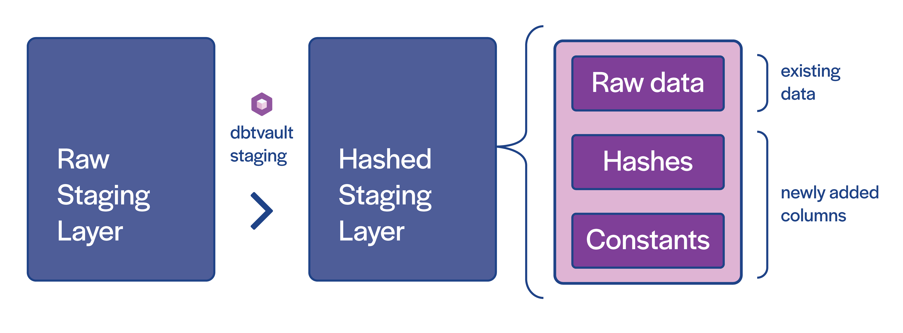

### Pre-conditions

1. The dbtvault package assumes you've already loaded a Snowflake database staging table with raw data 
from a source system or feed; the 'raw staging layer'.

2. All records in a single load must be for the same load datetime. This restriction is not applicable to Hubs and Links.
   We will be removing this restriction for other structures in the future. 

### Let's Begin

The raw staging table needs to be prepared with additional columns so that we may load our raw vault.
Specifically, we need to add hash keys, hashdiffs, and any implied fixed-value columns (see the above diagram).

We also need to ensure column names align with target Hub or Link table column names.

!!! info
    Hash keys are optional in Snowflake. Natural/business keys alone can be used in place of hashing. 
    
    We've implemented hashing as the only option for now, though a non-hashed version will be added in future releases, checkout our [roadmap](../roadmap.md).

### Creating staging models

To create a stage model, we simply copy and paste the above template into a model named after the staging table/view we
are creating. dbtvault will generate a stage using parameters provided in the next steps.

=== "v_stg_orders.sql"

    ```sql
    {{ dbtvault.stage(include_source_columns=true,
                      source_model=source_model,
                      derived_columns=derived_columns,
                      hashed_columns=hashed_columns,
                      ranked_columns=ranked_columns) }}
    ```

#### Materialisation

The recommended materialisation for a **stage** is `view`, as the stage layer contains minimal transformations on the 
raw staging layer which need to remain in sync. You may materialise some or all stages as tables if necessary, though this
can increase costs significantly for large amounts of data. 

### Adding the metadata

Let's look at the metadata we need to provide to the [stage](../macros.md#stage) macro.

##### Source model

The "source model" for a stage does not necessarily need to be a model. This means you do not need to manage
the raw stage via dbt models if you don't need to, and can simply reference tables in your database via a 
[dbt source](https://docs.getdbt.com/docs/building-a-dbt-project/using-sources).

The model provided in the 'Final model' section below, shows the use of the 'source style' 
[source_model syntax](../macros.md#source_model-syntax).

##### Derived columns

| Column Name    | Value                   |
|----------------|-------------------------|
| SOURCE         | !1                      |
| LOAD_DATETIME  | CRM_DATA_INGESTION_TIME |
| EFFECTIVE_FROM | BOOKING_DATE            |
| START_DATE     | BOOKING_DATE            |
| END_DATE       | TO_DATE('9999-31-12')   |

!!! Note "What is the '!'?"
    This is some syntactic sugar provided by dbtvault to create constant values. [Read More](../macros.md#constants-derived-columns)
    

##### Hashed columns

| Column Name        | Value                                                                                |
|--------------------|--------------------------------------------------------------------------------------|
| CUSTOMER_HK        | CUSTOMER_ID                                                                          |
| NATION_HK          | NATION_ID                                                                            |
| CUSTOMER_NATION_HK | CUSTOMER_ID, NATION_ID                                                               |
| CUSTOMER_HASHDIFF  | is_hashdiff: true, columns: CUSTOMER_NAME, CUSTOMER_ID, CUSTOMER_PHONE, CUSTOMER_DOB |

##### Final Model

When we provide the metadata above, our model should look like the following:

```jinja
{{ config(materialized='view') }}


source_model: 
  raw_staging: "raw_customer"
derived_columns:
  SOURCE: "!1"
  LOAD_DATETIME: "CRM_DATA_INGESTION_TIME"
  EFFECTIVE_FROM: "BOOKING_DATE"
  START_DATE: "BOOKING_DATE"
  END_DATE: "TO_DATE('9999-31-12')"
hashed_columns:
  CUSTOMER_HK: "CUSTOMER_ID"
  NATION_HK: "NATION_ID"
  CUSTOMER_NATION_HK:
    - "CUSTOMER_ID"
    - "NATION_ID"
  CUSTOMER_HASHDIFF:
    is_hashdiff: true
    columns:
      - "CUSTOMER_NAME"
      - "CUSTOMER_ID"
      - "CUSTOMER_PHONE"
      - "CUSTOMER_DOB"




{{ dbtvault.stage(include_source_columns=true,
                  source_model=metadata_dict['source_model'],
                  derived_columns=metadata_dict['derived_columns'],
                  hashed_columns=metadata_dict['hashed_columns'],
                  ranked_columns=none) }}
```

!!! Note
    See our [metadata reference](../metadata.md#staging) for more detail on how to provide metadata to stages.


#### Summary 

In summary this model will:

- Be materialized as a view
- Select all columns from the external data source `raw_customer`
- Generate hashed columns to create hash keys and a hashdiff
- Generate a `SOURCE` column with the constant value `1`
- Generate an `EFFECTIVE_FROM` column derived from the `BOOKING_DATE` column present in the raw data.
- Generate `START_DATE` and `END_DATE` columns for use in the [effectivity satellites](tut_eff_satellites.md) later on.

!!! Note "Using the staging macro"
    Take a look at the [stage section of the macro documentation](../macros.md#stage) for a more in-depth look at what you can do with the stage macro

### Running dbt

With our model complete and our YAML written, we can run dbt:

=== "< dbt v0.20.x"
    `dbt run -m v_stg_orders`

=== "> dbt v0.21.0"
    `dbt run --select v_stg_orders`

And our table will look like this:

| CUSTOMER_HK | NATION_HK | CUSTOMER_NATION_HK | CUSTOMER_HASHDIFF | (source table columns) | LOAD_DATETIME           | SOURCE | EFFECTIVE_FROM | START_DATE | END_DATE   |
|-------------|-----------|--------------------|-------------------|------------------------|-------------------------|--------|----------------|------------|------------|
| B8C37E...   | D89F3A... | 72A160...          | .                 | .                      | 1993-01-01 00:00:00.000 | 1      | 1993-01-01     | 1993-01-01 | 9998-31-12 |
| .           | .         | .                  | .                 | .                      | .                       | 1      | .              | .          | .          |
| .           | .         | .                  | .                 | .                      | .                       | 1      | .              | .          | .          |
| FED333...   | D78382... | 1CE6A9...          | .                 | .                      | 1993-01-01 00:00:00.000 | 1      | 1993-01-01     | 1993-01-01 | 9998-31-12 |

### Next steps

Now that we have implemented a new staging layer with all the required fields and hashes, we can start loading our vault.