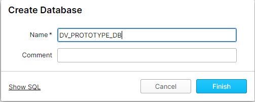
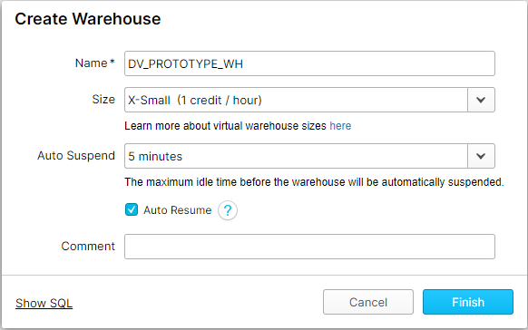

## Download the demonstration project

Assuming you already have a python environment installed, the next step is to download the latest 
demonstration project from the repository.

Using the button below, find the latest release and download the zip file, listed under assets.

[View Downloads](https://github.com/Datavault-UK/dbtvault-snowflakeDemo/releases){: .md-button .md-button--primary .btn }

Once downloaded, unzip the project.

## Installing requirements

Once you have downloaded the project, install all the requirements from the provided `requirements.txt` file.
First make sure the `requirements.txt` file is in your current working directory, then run:

`pip install -r requirements.txt`

This will install dbt and all of its dependencies, ready for 
development with dbt.

## Install AutomateDV

Next, we need to install AutomateDV. 
AutomateDV has already been added to the `packages.yml` file provided with the example project, so all you need to do 
is run the following command, inside the folder where your `dbt_project.yml` resides:
 
`dbt deps`

## Setting up AutomateDV with Snowflake

In the provided dbt project file (`dbt_project.yml`) the profile is named `snowflake-demo`.
In your dbt profiles, you must create a connection with this name and provide the snowflake
account details so that dbt can connect to your Snowflake databases. 

dbt provides their own documentation on how to configure profiles, so we suggest reading that
[here](https://docs.getdbt.com/dbt-cli/configure-your-profile/).

A sample profile configuration is provided below which will get you started:

=== "profile.yml"

    ```yaml linenums="1"
    snowflake-demo:
      target: dev
      outputs:
        dev:
          type: snowflake
          account: <bu77777.eu-west-1>
    
          user: <myusername>
          password: <mypassword>
    
          role: <SYSADMIN>
          database: DV_PROTOTYPE_DB
          warehouse: DV_PROTOTYPE_WH
          schema: DEMO
          threads: 4
          client_session_keep_alive: False
    ```

Replace everything in this configuration marked with `<>` with your own Snowflake account details.

Key points:

- You must also create a `DV_PROTOTYPE_DB` database and `DV_PROTOTYPE_WH` warehouse.

- Your `DV_PROTOTYPE_WH` warehouse should be X-Small in size and have a 5 minute auto-suspend, as we will
not be coming close to the limits of what Snowflake can process.

- The role can be anything as long as it has full rights to the above schema and database, so we suggest the
default `SYSADMIN`.

- We have set `threads` to 4 here. This setting dictates how 
many models are processed in parallel. In our experience, 4 is a reasonable amount and the full system is created in a 
reasonable time-frame, however, you may run with as many threads as required. 




## The project file

The `dbt_project.yml` file is used to tag and configure groups of models and set global variables for the project.

=== "dbt_project.yml"

    ```yaml linenums="1"
    name: dbtvault_snowflake_demo
    profile: dbtvault_snowflake_demo
    version: '5.0.0'
    require-dbt-version: ['>=0.18.0', '<0.19.0']
    config-version: 2
    
    analysis-paths:
      - analysis
    clean-targets:
      - target
    data-paths:
      - data
    macro-paths:
      - macros
    source-paths:
      - models
    test-paths:
      - tests
    target-path: target
    
    vars:
      load_date: '1992-01-08'
      tpch_size: 10 #1, 10, 100, 1000, 10000
    
    models:
      dbtvault_snowflake_demo:
        raw_stage:
          tags:
            - 'raw'
          materialized: view
        stage:
          tags:
            - 'stage'
          enabled: true
          materialized: view
        raw_vault:
          tags:
            - 'raw_vault'
          materialized: incremental
          hubs:
            tags:
              - 'hub'
          links:
            tags:
              - 'link'
          sats:
            tags:
              - 'satellite'
          t_links:
            tags:
              - 't_link'

    ```
#### global vars

Before the models section of the file, we have vars that will be globally scoped to all resources in the project.

##### load_date
To simulate day-feeds, we use a variable we have named `load_date` which is used in the `RAW` models to
load for a specific date. This is described in more detail in the [Profiling TPC-H](we_tpch_profile.md) section.

##### tpch_size

The default TPCH dataset size used by the demo project is 10, which means the volume of data is in the 10s of millions of rows. 

This can be modified by changing the `tpch_size` variable. This can be one of `1, 10, 100, 1000, 10000`. 

More details on these sizes can be found [here](https://docs.snowflake.com/en/user-guide/sample-data-tpch.html#database-and-schemas). 

#### models

In the models section we are providing tags for each sub-folder of the models folder, and specifying appropriate 
materialisations for each type of vault structure. 

We have also specified that they are all enabled, as well as their materialization. Many of these attributes 
can also be provided in the files themselves.


#### Metadata 

Metadata for each structure is provided in each file, for example:

=== "hub_customer.sql"

    ```jinja
    
    
    
    
    
    
    {{ automate_dv.hub(src_pk=src_pk, src_nk=src_nk, src_ldts=src_ldts,
                       src_source=src_source, source_model=source_model) }}
    ```

Take a look at our [metadata reference](../metadata.md) for a full reference and recommendations for providing metadata.

